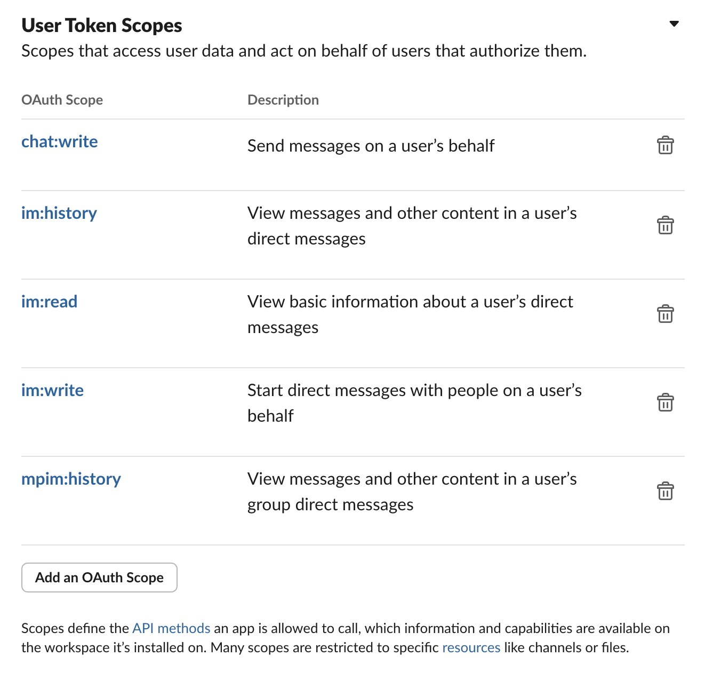
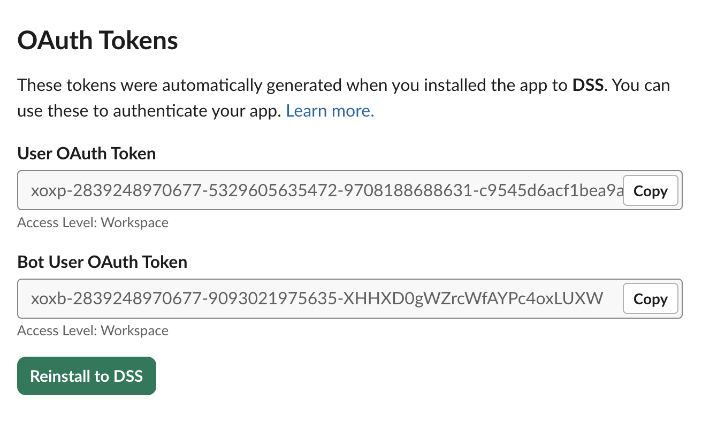

# Environment setup
- npm i

- Create config.json file from config.json.sample

# Where to get userToken?

- https://api.slack.com/apps

- Create new app

- Go to `OAuth & Permissions`

- Select the following `User Token Scopes`

- Scroll up and copy `User OAuth Token`

- If the run script fails with authentication errors, try `Reinstall to DSS`

# Run script

- Update config.json file

- Run `node index.js`

